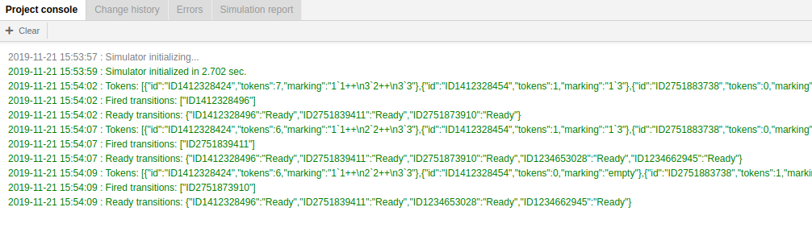
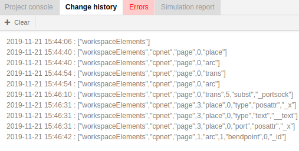
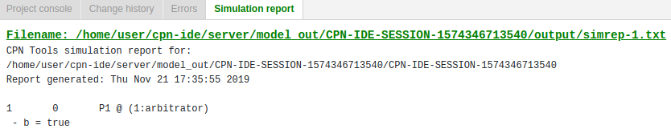

# Console panel
Console panel consists of 4 tabs:

- **Project console** tab contains entries about the results of model validation and events occuring during model simulation.

 
To clear the Project console tab, press **+ Clear** button.

- **Change history** tab contains entries about changes made by a user during model creating and editing.

To clear the Change history tab, press **+ Clear** button.

- **Errors** tab contains a list of errors revealed by the program during syntax checking.

 

- **Simulation report** contains information regarding the transitions that occur during a simulation.

 