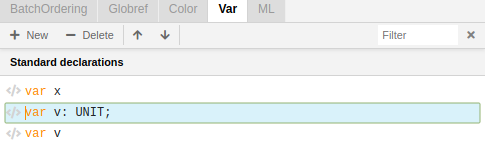
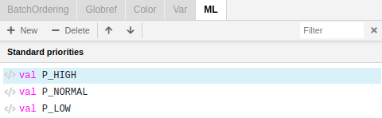

## Declarations Panel
---

The **Declarations Panel** is located under the Project tree. It consists of five tabs (BatchOrdering, Globref, Color, Var, ML) classifying the declarations in a more detailed way than in the Project tree.

Operations for creating, deleting and editing declarations contained in these tabs are the same for each of these tabs:
 

- You can create or delete new lines by bringing up the right-click menu and selecting the appropriate option or by using the buttons **+ New** | **- Delete** on the top of the Declaration Panel.
 

  
 

- To edit a declaration simply click on the text to enter text edit mode. You can also edit it using the **ML editor**.
 

  
 

- Navigating between the lines can be made by pressing **Shift+Up** / **Shift+Down** or by pressing the buttons on the top of the Declarations Panel.
 

  
 

### BatchOrdering

The **BatchOrdering** tab replicates the list of declarations in the Declarations entry in the Project tree. All changes made in the Declarations entry in the Project tree appear concurrently in the BatchOrdering tab.

### Globref
The **Globref** tab contains a list of reference variables.

There must be a corresponding block **Globref** in the Project tree if you want to create a new reference variable within this tab. 

### Color
The Color tab contains a list of color sets. 

### Var
**Var** tab contains variables that are used in CP-net inscriptions.

### ML
**ML** tab contains value declarations corresponding to the Standard priorities block in the Project tree. 

You can edit declarations within this tab but it's often easier to edit a declaration using the **ML editor** if its description is very complex.

