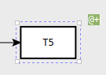
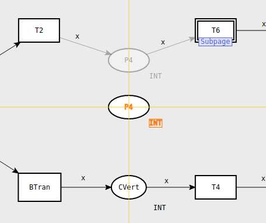
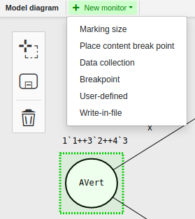
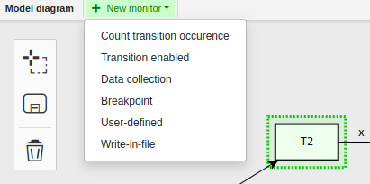

## Editor View
---

Editor View is the workspace for creating a net. You can either load an existing net or create a new one.

To create a new net, click on **New Project**.

To load a net, click on **Open project** and select the desired net.

## Tools

### Creating objects
One of the instruments for creating net objects is the mouse right-click button menu. You can bring it up by clicking the right mouse button in the editor area.

To create a new **place** or **transition**, select the corresponding option of the menu.

Having created an object, you can create the next one by putting the cursor on the first object and bringing up the menu with the right mouse button click. A place can be related only to a transition and a transition can be related only to a place. It's impossible to make an arc between two transitions or two places.

To create an **arc**: 
 
- click on a place or transition to bring up the menu 

- select the arrow icon
- draw the arc to the object you wish to connect to.

### Creating new subpage
When a CP-net uses a substitution transition the logic that the transition represents must be kept somewhere. It is kept on a page called a **subpage**.
A page that contains a substitution transition is called a **superpage**. 

To create a **new subpage**, select the corresponding option in the right-click menu. A new page is created. It is set as a subpage in the Project Tree panel.

The subpage has a mark, it looks as follows:

To connect a subpage to other objects of the net, use arcs.

#### Creating diagram on subpage

Having made a subpage, create new objects on it. You can also move already existing objects from the superpage to the subpage. To move a group of existing objects, use the menu:

- Press the lasso icon (the top icon)
- Select objects to be replaced to the subpage by drawing the lasso with the pointer
- Press the icon in the middle ("Move selected objects to subpage")

#### Selecting port type

When creating a diagram on the subpage, places at the ends of the diagram must be set as **ports**. Ports can be of 3 types: **In** | **Out** | **In/Out**. To set a port:

- click on the place at the left end of the diagram
- select a port type in the corresponding line of the Properties panel

Repeat the same with the right end place.

In the picture below the places at the ends of the diagram are **ports**. They can be labeled as **In** / **Out** / **In/Out** according to the selected port type.

A substitution transition having been created, places surrounding the substitution transition become **sockets**. On the picture below sockets are places **CVert** and **P3**.

 

#### Selecting port bind

When creating a subpage, arcs surrounding the substitution transition must get a port bind.
To get a port bind for an arc:
- click on the arc
- select a port bind in the corresponding line of the Properties panel

**If you don't set port types and port binds for places and arcs surrounding a substitution transition, mistakes occur**. (see an example in the picture below)

### Deleting objects

To delete a place, an arc or a transition put the cursor on the object to be removed, bring up the right-click menu and select the bin icon.

You can also remove several objects at once using the menu in the upper left corner of the Editor View. 

To delete a group of objects:
 
- Press the lasso icon (the top icon)
 
- Select objects to be removed by drawing the lasso with the pointer
 
- Press the bin icon

## Inscriptions

### Adding inscriptions
To add an inscription, click on the place, transition, or arc where you want to add the inscription. This activates the text edit mode for the object you have clicked on.

Immediately after creating a place, transition, or arc you are also in the text edit mode, and can add the first inscription right away.

To switch between inscriptions of an object, put the cursor on the object and use the **Tab** key.

### Place inscriptions
Place inscriptions are created when you add/edit inscriptions for places. There are three inscriptions that may be associated with a place.

- Place name inscription – optional. The place name inscription is an optional label that identifies the place, and it may contain any sequence of characters.

- Color set inscription – required. The color set inscription determines the color set, i.e. the type of all the tokens that can be put in the place. 

*Default color set inscription*

 

- Initial marking inscription – optional. The initial marking inscription is a multiset expression that specifies the initial tokens for a place. 

*Default initial marking inscription*

### Transition inscriptions
Transition inscriptions are created when you add/edit inscriptions for transitions.
There are five inscriptions that may be associated with a transition. All are optional:

- Transition name inscription

- Condition inscription

*Default condition inscription*

- Time inscription

*Default time inscription*

- Code segment inscription

*Default code inscription*

- Priority inscription

*Default priority inscription*

### Arc inscriptions

Arcs have only one inscription — the arc inscription. An arc inscription is a CPN ML expression that evaluates to a multiset or a single object.

*Default arc inscription*

## ML editor
ML editor is a tab for creating declarations using ML code. It's easier to write a declaration in the **ML editor** if the declaration is very complex.

## Tabs
The number of tabs related to the Editor View depends on how many pages have been created. Clicking on a page in the Project tree (block "Pages") opens the corresponding tab in the Editor View. You can switch between the pages either by clicking on the names of pages in the Project tree 

or by clicking on the tabs in the Editor View

### Diagram zooming 
To zoom in or out, hold the **Ctrl** key and scroll the mouse wheel.

### Resizing objects
To resize an object: 
 
- put the pointer on any corner of the object
 
- when you see the pointer as two-way arrow, drag the corner of the object to get desired size and form.

### Diagram moving
To move a diagram across the Editor View, set the pointer in the free space of the Editor View, hold down the left mouse key and move the pointer. The diagram will repeat the movements of the pointer.

To move a particular object, put the cursor in the object, hold down the left mouse key and move the pointer.

While moving the object, you can see **magnetic guidelines** (orange lines in the picture below). 

Magnetic guidelines are horizontal and vertical lines which can be used for aligning your objects during the graphical editing of the net.

## Monitors

A monitor is a mechanism in CPN Tools that is used to observe, inspect, control, or modify a simulation of a CP-net. Many different monitors can be defined for a given net. Monitors can inspect both the markings of places and the occurring binding elements during a simulation, and they can take appropriate actions based on the observations.

### Create a monitor
To create a monitor 

- select the objects to be monitored. It can be done either by applying the **lasso tool** from the panel

or by pressing **CTRL + right mouse button click** (use the same combination to deselect an object).

As a result, the selected objects get highlighted in green and a new green tab called **+ New monitor** appears in the Editor View. 

- Having selected the objects, click on **+ New monitor** tab and choose a monitor type by one-click. 

There are 4 types of monitors that are common for any selected object/group of objects:

- **Breakpoint monitors** are used to stop a simulation when certain conditions are fulfilled.

- **Data collection monitors** are used to extract numerical data from a net. The numerical data is then used to calculate statistics, and the data can be saved in log files. The log files can then be post-processed, e.g. by importing them into spreadsheet programs or plotting them in graphs.

- **Write-in-file monitors** are used to update files during simulations.

- **User-defined monitors** are generic monitors that can be used for any purposes that are not covered by the other kinds of monitors. For example, a user-defined monitor could be used to update a message sequence chart (MSC) or to check that a particular property holds during the simulation.

#### Monitor types for a place
If you select just one place, a list of available monitor types looks as follows:

In addition to the common monitor types described above, there are two more types that are available only for a place.

- A **Marking size** monitor extracts the number of tokens on a particular place during a simulation, and it is used to calculate, e.g. the average number of tokens on the place during a simulation.

- A **Place content break point** monitor checks the number of tokens on a place to determine if a simulation should be stopped. The simulation can be stopped when the place is either empty – that is, when there are no tokens on the place – or not empty – that is, when there is at least one token on the place.

To create a desired monitor, click on the corresponding option in the **+ New monitor** menu. 

#### Monitor types for a transition
If you select just one transition, a list of monitor types available looks as follows:

In addition to the common monitor types described above, there are two more types that are available only for a transition.

A **Count transition occurence** monitor is used to calculate the number of times a particular transition occurs during a simulation.

A **Transition enabled** monitor checks whether the appropriate transition is enabled after every step in a simulation. If at least one place in the net has a timed color set, then the Transition enabled monitor will also check if the transition is enabled whenever the model time is increased. A Transition enabled monitor will not check if the transition is enabled before the first step in a simulation.

To create a desired monitor, click on the corresponding option in the **+ New monitor** menu. 