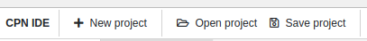
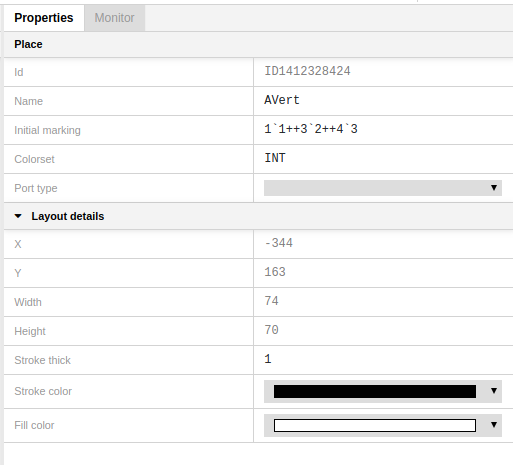
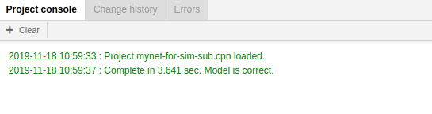

## The Interface

To get started working on a CPN, you can either load an existing net or create a new one.

If you want to load a project, press **Open project**

For creating a new project, press **New project**

When you open CPN IDE, you see a window, containing the following panels and areas:

### Project tree 

### Declaration panel

### Editor view

### Properties panel

### Console panel

