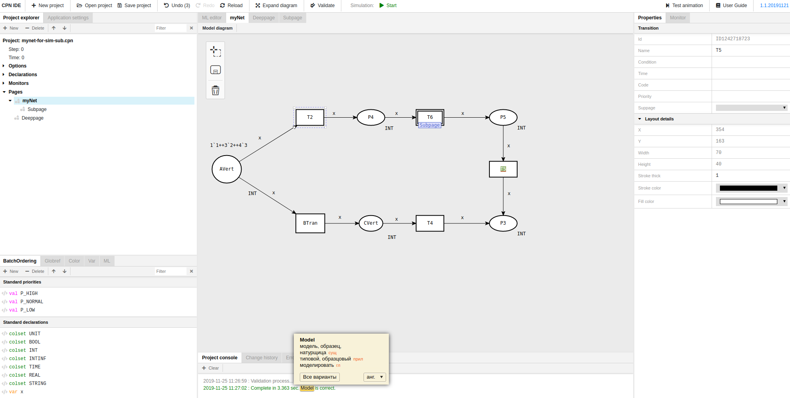
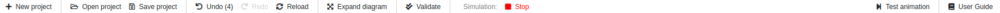
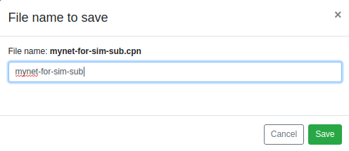
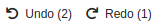
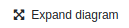
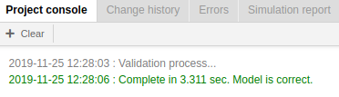
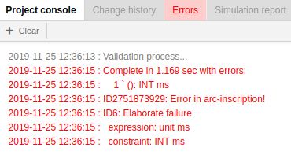
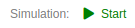
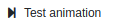
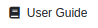

## GUI
---
When you open CPN IDE, you see a window as in the picture below

### Top bar

To get started working on a CPN, you can either load an existing net or create a new one.

To create a new project, press **New project**.

To load a project, press **Open project**.

To save your net, press **Save project**. You will see a window **File name to save**. 

You can save the net under a different name by text editing the net name. After entering the net name, press **Save**.
F
To undo or redo an operation made during the net editing, use the buttons **Undo** | **Redo**. 

To reload a net you are working on, press **Reload**.

To expand the field of Editor View, press **Expand diagram**.

Click on **Validate** to check your model for errors.

If there are no errors in the model, you'll see the following entry in green in the Console panel:

If there is any error in the model, you'll see error notifications in red in several panels of CPN IDE. For example, in the Console panel it looks as follows:

To run simulation of an existing model, press **Start**. 

To stop simulation, press **Stop**.

To check how diagram animation is carried out, press **Test animation**. 

Press **User Guide** to open the help pages.

### Project tree 

### Declarations panel

### Editor view

### Properties panel

### Console panel

