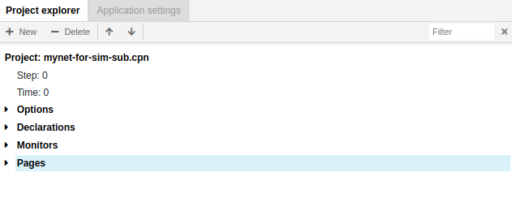
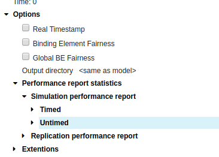
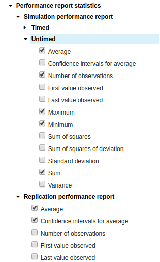
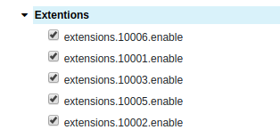
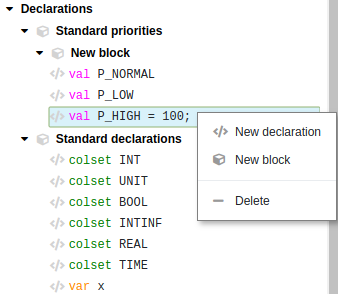
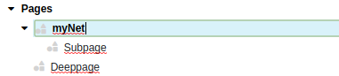
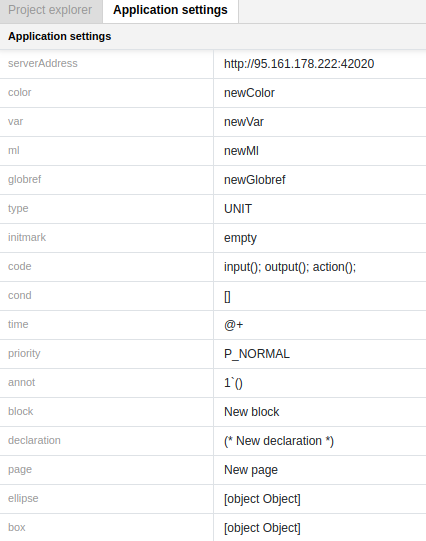

## Project Tree 
---

Project tree is labeled with the name of the net. In the picture below, the net is named **mynet-for-sim-sub.cpn**. 

There are two more points below the name of the net:

**Step** means the number of steps that have executed in a simulation.

**Time** means the current model time.

Project tree contains a number of entries that provide some information about a net and tools for creating and editing it. Click on the black triangle next to the name to open the entry, if it is not already opened.

## Options

The **Options** entry in the Project tree provides an overview of the options that are related to a particular net.

You may choose an option by putting a tick on it.

#### Real Timestamp

#### Binding Element Fairness

#### Global BE Fairness

Fix a bug which caused instances of the first enabled transition instance to have slightly higher probability of being chosen and instances of the last slightly lower when using global binding element fairness. Especially visible if you have just two transitions with one enabled binding, where one would be starved if the other was always enabled.

When using global binding element fairness, sometimes the transition would appear more than once in the simulation report.

#### Output directory 

The Output directory option determines where various kinds of output files will be saved. The default output directory is indicated by the text **same as model**, but the default output directory is actually **model-dir/output/** where **model-dir** is the directory in which the model is saved.

To change the output directory for a net, edit the text of the option. To enter text edit mode, simply click on the text.

### Performance report statistics

The Performance report statistics options are used to determine which statistics should be included in different kinds of performance output. A check mark next to a statistic indicates that the statistic will be included in the appropriate report.

The **Simulation performance report** options are used to select the statistics to be included in simulation performance reports. 

The **Replication performance report** options are used to select the statistics to be included in replication performance reports

### Extensions
Put ticks on extensions you would like to choose.

## Declarations

In the picture below the Declarations entry consists of two blocks:
 
- Standard priorities
 
- Standard declarations

You can add or delete declarations and declaration blocks by right-clicking and selecting the appropriate option or by using the buttons **+ New** | **- Delete** on the top of the Project tree.
 

To add a declaration or a declaration block you can also use **Shift+Insert**.

To delete a declaration or a declaration block you can use **Shift+Delete**.

To edit a declaration or block, open it by clicking on the triangle next to it, and then click on the declaration or block text. 

Navigating within the elements of Declarations blocks is possible by
 
  
- clicking with the mouse to choose a specific position 
 
- using the hot-key combinations **Shift+Up** / **Shift+Down**
 
- pressing keys on the top of the Project tree
 

The added declaration will appear either at the bottom of the list of declarations or below the declaration where you added it. 
The declaration will be in text edit mode when it appears, so it can be modified right away.

## Monitors

## Pages
All **pages** in a net are accessible through the **Project tree**. 

The hierarchical structure of a net is reflected in the Project tree. The entry for a subpage appears under the entry for its superpage, and the entry for the subpage is indented with respect to the entry for its superpage. Subpage entries are visible in the Project tree when the corresponding superpage entry has been opened.

If you have created a new net instead of loading one, there will be only one page. This page is created automatically with the new net, and is empty so you can start creating net objects on it.

You can create or delete new pages (subpages) by bringing up the right-click menu and selecting the appropriate option or by using the buttons **+ New** | **- Delete** on the top of the Project tree.

# Application settings

The Application settings tab shows the default settings for declarations, pages and objects created. To change the settings click on the text you wish to edit.