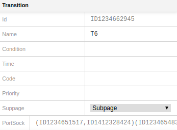
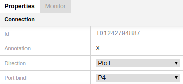

# Properties Panel
---

The **Properties Panel** is located on the right side of the window. It includes 2 tabs: **Properties** and **Monitor**.

## Properties tab
Properties tab shows the properties of an object including layout details.

To bring up Properties tab for a particular object, click on the object in the Editor View.

### Layout details
To open the layout details menu, click on the triangle next to "Layout" if it's not already opened. 

**X** and **Y** show the coordinates of an object in two-dimensional space.

**Width** and **Height** show an object size.

**Stroke thick** defines an object frame thickness.

**Stroke color** allows to select a color for an object frame.

**Fill color** allows to select an object color. 

## Place properties

To bring up Properties tab for a particular place, click on the place in the Editor View.

To edit a property, click on the cell to enter text edit mode. 

Object **ID** can't be edited.  

**Name** identifies a place, it may contain any sequence of characters.

**Initial marking** is a multiset expression that specifies the initial tokens for a place. The color set for the initial marking expression must match the color set of the place. 

**Colorset** determines the color set, i.e. the type of all the tokens that can be put in the place. 

**Port type** can get one of the modes: IN, OUT, IN/OUT, or Empty. After selecting one of the modes, a place acquires a corresponding label:

## Transition properties

 

To bring up Properties tab for a particular transition, click on the transition in the Editor View.

To edit a property, click on the cell to enter text edit mode. 

Object **ID** can't be edited.  

**Name** identifies a transition, it may contain any sequence of characters. It corresponds to a name inscription given to the transition in the Editor View.

**Condition** is a CPN ML Boolean expression that evaluates to true or false. It is used for tests on input arc inscription variables. It corresponds to a condition inscription given to the transition in the Editor View.

**Time** is a transition delay. The expression is preceded by **@+**.
It corresponds to a time inscription given to the transition in the Editor View.

**Code**. Each transition may have an attached code segment which contains ML code. Code segments are executed when their parent transition occurs. It corresponds to a code segment inscription given to the transition in the Editor View.

**Priority** must be a non-negative integer expression. The lower the value, the higher the priority. Hence, a transition with priority value 1 has priority over a transition with priority value 2. It corresponds to a priority inscription given to the transition in the Editor View.

**Subpage** allows to select a subpage for the given substitution transition. After selecting a subpage, a blue label with the name of the subpage shows up on the transition. You can move this label to any place of the Editor View.

 

**PortSock** shows up when a transition becomes a substitution transition. PortSock contains ID of ports and sockets assigned to a substitution transition.

 

## Arc (connection) properties
 

To bring up the Properties tab for a particular arc, click on the arc in the Editor View.

To edit a property, click on the cell to enter text edit mode. 

Object **ID** can't be edited.  

**Annotation** is a CPN ML expression that evaluates to a multiset or a single object. It corresponds to an arc inscription given to the arc in the Editor View. You can edit it either in the Editor View or in the Properties tab.

**Direction** allows to select the direction of an arc.

 

- PtoT - from place to transition
- TtoP - from transition to place
- BOTHDIR - both directions

**Port bind** property shows up if an arc is connected to a substitution transition. 

## Monitor tab

Monitor tab provides information about a monitor applied to a net. 

There can be 8 types of monitors:

- Breakpoint monitor
- Data collection monitor
- Write-in-file monitor
- User-defined monitor
- Marking size monitor
- Place content break point monitor
- Count transition occurence monitor
- Transition enabled monitor

To see information about a particular monitor, click on the corresponding entry in the Monitors block of the Project tree. After that the information appears on the Monitor tab of the Properties Panel.

### Modifyng a monitor

Monitor tab allows to modify a monitor. Changes made in the monitor tab appear concurrently in the corresponding entries of the Project tree.

Monitor tab for each kind of monitors contains the following entries:

- **ID** is non-editable.
 

- **Name** shows the name of the monitor. Click on the name to enter text edit mode if you need to change it.
 

- **Type** is non-editable.
 

- **Timed** can be **True** or **False**. Press the black triangle to select one of the options.
 

- **Logging** determines whether the data values that are collected during a simulation should be saved in a log file. Can be **True** or **False**. Press the black triangle to select one of the options.
 

- **Disabled** shows if a monitor is active or inactive. If a monitor is disabled, the value is true. To enable and disable a monitor, move a **switch button** on the upper panel of the Monitor tab (the one in the middle in the picture below). 

**Nodes** entry contains information about objects that are monitored. 

Deleting objects from a monitor is made by clicking the **bin icon**.

The Monitor tab for such monitor types as

- Marking size monitor
- Place content break point monitor
- Count transition occurence monitor
- Transition enabled monitor

contains the Monitoring functions code. **To edit function** code, click on it to get text edit mode. You can also edit functions in the ML editor.

*Predicate* - predicate function is for checking if the relevant condition is fulfilled. It determines when a monitor should be activated.
It periodically examines the places and transitions associated with the monitor. 

*Observer* - observation function is for extracting information from the places and transitions that are associated with the monitor.

*Init function* - initialization function is used to extract data from a CP-net and/or initialize monitors before a simulation is started the first time. 

*Stop* - stop function is used to extract data from a CPN and/or conclude the work of a monitor when simulation stop criteria have been met.
 
 

#### Cloning a monitor
To clone a monitor, click on the left-end button: 

#### Disabling a monitor
To enable/disable a monitor, click on the switch button in the middle:

#### Deleting a monitor
To delete a monitor, click on **- Delete**:

### Examples of monitors
#### Breakpoint monitor

 

#### Data collection monitor

 

#### Write-in-file monitor

 

#### User-defined monitor

 

#### Marking size monitor

#### Place content break point monitor

 

#### Count transition occurence monitor

 

#### Transition enabled monitor

 