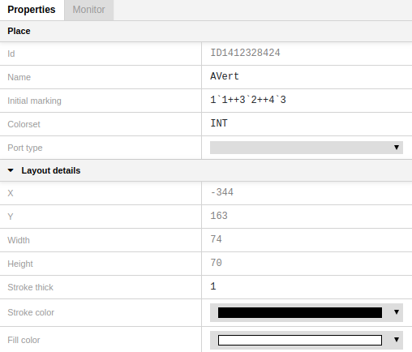

## Properties Panel
---

The **Properties Panel** is located on the right side of the window. It shows the properties of an object including layout details.

To bring up the Properties panel for a particular object, click on the object in the Editor View.

### Layout details
To open the layout details menu, click on the triangle next to "Layout" if it's not already opened. 

**X** and **Y** show the coordinates of an object in two-dimensional space.

**Width** and **Height** show an object size.

**Stroke thick** defines an object frame thickness.

**Stroke color** allows to select a color for an object frame.

**Fill color** allows to select an object color. 

## Place properties

To bring up the Properties panel for a particular place, click on the place in the Editor View.

To edit a property, click on the cell to enter text edit mode. 

Object **ID** can't be edited.  

**Name** identifies a place, it may contain any sequence of characters.

**Initial marking** is a multiset expression that specifies the initial tokens for a place. The color set for the initial marking expression must match the color set of the place. 

**Colorset** determines the color set, i.e. the type of all the tokens that can be put in the place. 

**Port type** can get one of the modes: IN, OUT, IN/OUT, or Empty. After selecting one of the modes, a place acquires a corresponding label:

## Transition properties

 

To bring up the Properties panel for a particular transition, click on the transition in the Editor View.

To edit a property, click on the cell to enter text edit mode. 

Object **ID** can't be edited.  

**Name** identifies a transition, it may contain any sequence of characters. It corresponds to a name inscription given to the transition in the Editor View.

**Condition** is a CPN ML Boolean expression that evaluates to true or false. It is used for tests on input arc inscription variables. It corresponds to a condition inscription given to the transition in the Editor View.

**Time** is a transition delay. The expression is preceded by **@+**.
It corresponds to a time inscription given to the transition in the Editor View.

**Code**. Each transition may have an attached code segment which contains ML code. Code segments are executed when their parent transition occurs. It corresponds to a code segment inscription given to the transition in the Editor View.

**Priority** must be a non-negative integer expression. The lower the value, the higher the priority. Hence, a transition with priority value 1 has priority over a transition with priority value 2. It corresponds to a priority inscription given to the transition in the Editor View.

**Subpage** allows to select a subpage for the given substitution transition. After selecting a subpage, a blue label with the name of the subpage shows up on the transition. You can move this label to any place of the Editor View.

 

**PortSock** shows up when a transition becomes a substitution transition. PortSock contains ID of ports and sockets assigned to a substitution transition.

 

## Arc (connection) properties
 

To bring up the Properties Panel for a particular arc, click on the arc in the Editor View.

To edit a property, click on the cell to enter text edit mode. 

Object **ID** can't be edited.  

**Annotation** is a CPN ML expression that evaluates to a multiset or a single object. It corresponds to an arc inscription given to the arc in the Editor View. You can edit it either in the Editor View or in the Properties Panel.

**Direction** allows to select the direction of an arc.

 

- PtoT - from place to transition
- TtoP - from transition to place
- BOTHDIR - both directions

**Port bind** property shows up if an arc is connected to a substitution transition. 
